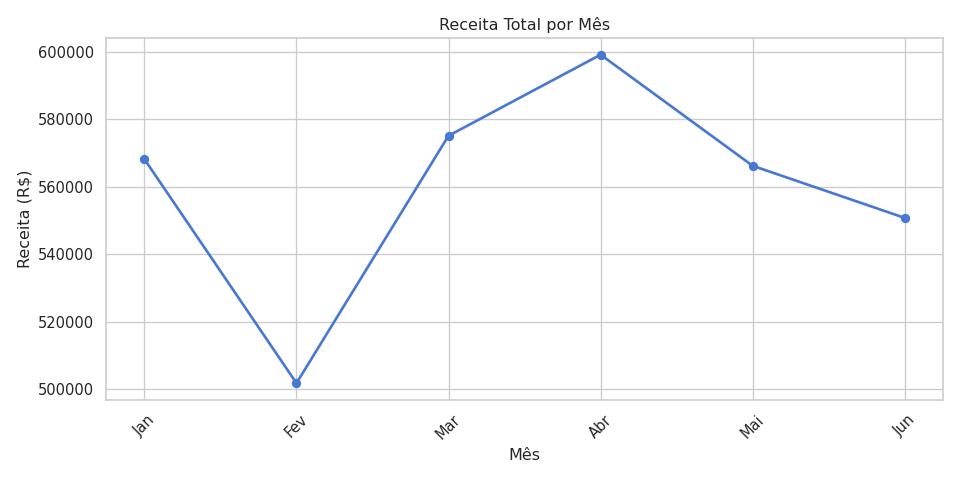
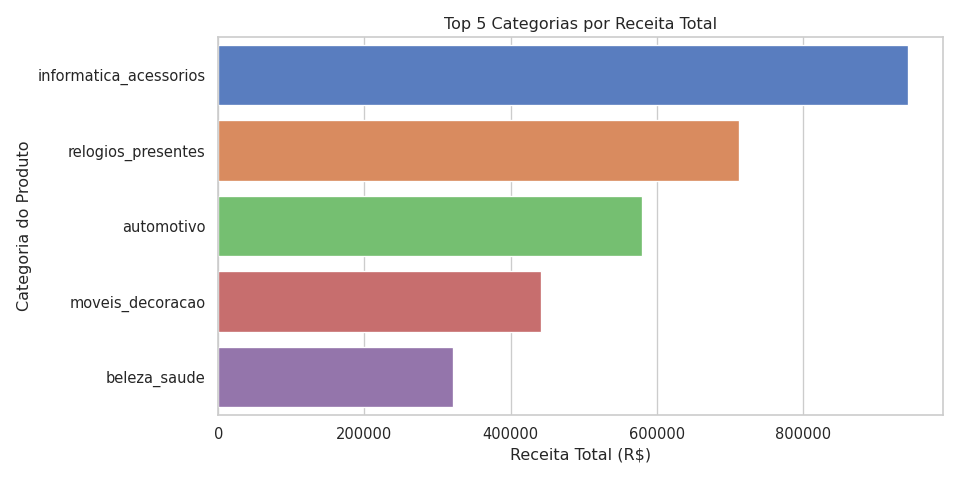
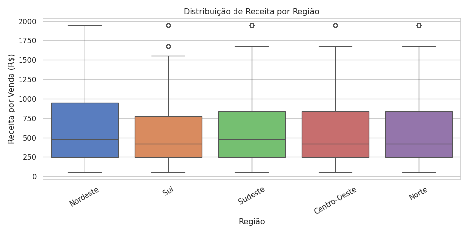

# 📊 Projeto DataView — Pipeline de Engenharia e Análise de Dados

> 🚀`

[](https://www.python.org/)
[](https://pandas.pydata.org/)
[](https://numpy.org/)
[](https://peps.python.org/pep-0008/)

Este repositório contém o desenvolvimento completo do **DataView**, um pipeline automatizado de ponta a ponta focado no ecossistema de e-commerce brasileiro (inspirado nos padrões de dados da *Olist*).

O objetivo principal do sistema foi simular uma base bruta com falhas sistêmicas estruturais, aplicar um processo defensivo de higienização de dados, extrair inteligência estatística e consolidar relatórios analíticos prontos para a tomada de decisão.

---

# 📚 Sumário

- [🏗️ Estrutura do Projeto](#️-estrutura-organizacional-do-repositório)
- [⚙️ Tecnologias Utilizadas](#️-tecnologias-utilizadas)
- [🚀 Como Executar](#-como-executar)
- [🔄 Arquitetura do Pipeline](#-arquitetura-do-pipeline)
- [📈 Etapas do Pipeline](#-etapas-do-pipeline)
- [📊 Visualizações](#-visualizações)
- [🌟 Boas Práticas](#-boas-práticas-e-qualidade-de-software)
- [🔮 Próximos Passos](#-próximos-passos)
- [👨‍💻 Autor](#-autor)

---

# 🏗️ Estrutura Organizacional do Repositório

O projeto segue estritamente a arquitetura de diretórios recomendada pelas boas práticas de mercado para projetos de dados, garantindo o desacoplamento entre dados brutos, processados e outputs analíticos:

```text
Projeto/
├── data/
│   ├── raw/
│   ├── processed/
│   │   ├── v1_com_outliers/
│   │   └── v2_outliers_tratado/
│   └── final/
├── notebooks/
├── outputs/
│   ├── graficos/
│   ├── metricas_por_mes.csv
│   ├── segmentacao_clientes.csv
│   └── estatisticas_gerais.json
├── dataview.py
└── README.md
```

---

# ⚙️ Tecnologias Utilizadas

| Tecnologia | Finalidade |
|-------------|------------|
| Python 3.9+ | Linguagem principal |
| Pandas | Manipulação e análise de dados |
| NumPy | Computação científica e vetorização |
| Matplotlib | Visualizações |
| Seaborn | Visualizações estatísticas |
| Regex (re) | Limpeza e padronização de textos |
| JSON | Persistência de dados |
| CSV | Armazenamento tabular |

---

# 🚀 Como Executar

Clone o repositório:

```bash
git clone https://github.com/seu_usuario/dataview.git
```

Entre na pasta:

```bash
cd dataview
```

Instale as dependências:

```bash
pip install pandas numpy matplotlib seaborn
```

Execute o pipeline:

```bash
python dataview.py
```

---

# 🔄 Arquitetura do Pipeline

```text
Dados Brutos
      ↓
RF01 - Geração do Dataset
      ↓
RF02 - Auditoria Estrutural
      ↓
RF03 - Limpeza e Higienização
      ↓
RF04 - Tratamento de Outliers
      ↓
RF05 - Feature Engineering
      ↓
RF06 - Métricas Agregadas
      ↓
RF07 - Segmentação de Clientes
      ↓
RF08 - Estatísticas com NumPy
      ↓
RF09 - Visualizações
      ↓
RF10 - Funções Reutilizáveis
      ↓
RF11 - Exportação e Auditoria
      ↓
RF12 - Dataset Final
```

---

# 📈 Etapas do Pipeline

## RF01 — Criar ou Carregar o Dataset de Vendas

- Simulação do cenário de e-commerce;
- Injeção controlada de inconsistências;
- Dados inspirados no ecossistema Olist.

## RF02 — Inspecionar e Descrever os Dados

- Tipos de dados;
- Valores ausentes;
- Estatísticas descritivas iniciais.

## RF03 — Limpar e Tratar os Dados 

- Tratamento de valores nulos;
- Regex para padronização de textos;
- Conversão de datas;
- Aplicação de regras de negócio.

## RF04 — Detectar e Tratar Outliers (versões v1 e v2)

Aplicação do método estatístico IQR para obtenção de duas versões:

- V1 — Com Outliers;
- V2 — Sem Outliers.

## RF05 — Criar Colunas Derivadas com Transformações

Criação de:

- Receita total;
- Ano;
- Mês;
- Trimestre;
- Ano-Mês;
- Faixas de receita.

## RF06 — Calcular Métricas Agregadas (groupby)

Agrupamentos por:

- Mês;
- Categoria;
- Região;
- Faixa de valor.

## RF07 — Segmentar Clientes por Nível de Gasto

Classificação em:

🥇 Ouro

🥈 Prata

🥉 Bronze

## RF08 — Calcular Estatísticas com NumPy

Cálculo de:

- Média;
- Mediana;
- Desvio padrão;
- Percentis;
- Participação percentual;
- Broadcasting.

## RF09 — Criar Visualizações com Matplotlib e Seaborn

Geração automática de:

- Gráfico de linha;
- Gráfico de barras;
- Boxplot.

## RF10 — Organizar o Código em Funções Reutilizáveis

Aplicação de:

- Higher-Order Functions;
- Callbacks;
- Expressões Lambda.

## RF11 — Ler e Escrever Arquivos (CSV e JSON)

Persistência em:

- CSV;
- JSON;

Validação automática da integridade dos arquivos.

## RF12 — Consolidar a Análise e Salvar o Dataset Final

Consolidação da base de produção:

```text
data/final/vendas_final.csv
```

---

# 📊 Visualizações

## 📈 Receita Total por Mês



---

## 📊 Top Categorias por Receita



---

## 📦 Distribuição de Receita por Região



# 🌟 Boas Práticas e Qualidade de Software

### ✔ Conformidade PEP 8

- Importações centralizadas;
- Nomenclaturas padronizadas;
- Código modular;
- Docstrings em todas as funções.

### ✔ Programação Defensiva

- Uso de `.copy()`;
- Tratamento de exceções;
- Auditoria dos dados.

### ✔ Clean Code

- Funções reutilizáveis;
- Separação por responsabilidade;
- Código legível.

### ✔ Vetorização

- Pandas;
- NumPy;
- Broadcasting.

---

# 🔮 Próximos Passos

## 🗄️ Modelagem Relacional SQL

Separação em dimensões:

- dim_produtos
- dim_categorias

Relacionadas por chaves estrangeiras.

---

## ⚙️ Orquestração

Integração com:

- Apache Airflow

Para:

- DAGs;
- Retentativas automáticas;
- Monitoramento do pipeline.

---

## ☁️ Data Lake

Persistência em:

- Amazon S3;
- Google Cloud Storage.

Com particionamento:

```text
ano/
└── mes/
    └── dia/
```

---

# 👨‍💻 Autor
Autor: Leandro Wallauer dos Santos

Projeto desenvolvido durante a formação SC-Tec | LAB365 para consolidar conhecimentos em Engenharia e Análise de Dados, abrangendo Data Cleaning, Feature Engineering, Estatística Aplicada, Visualização de Dados e boas práticas de desenvolvimento em Python.

- Engenharia de Dados;
- Data Cleaning;
- Feature Engineering;
- Estatística Aplicada;
- NumPy;
- Pandas;
- Visualização de Dados;
- Programação Defensiva;
- PEP 8;
- Clean Code.

---

## ⭐ Se este projeto foi útil, considere deixar uma estrela no repositório.
